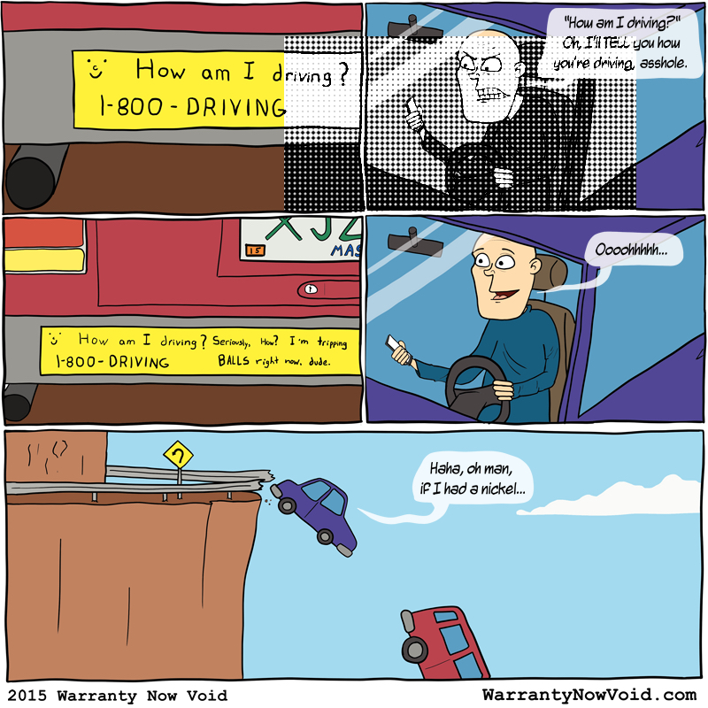

# Warranty Now Void v5

The world is falling apart. Things are getting weird, bad, weirdly bad, and badly weird. We simply couldn't stand by and watch this happen without doing something. And so we brought this website back into existence with the explicit purpose of hurrying that process along. 

# Building/Running/Installing

## Prerequisites

- node/npm (only if enabling `vibrant-posts` or using tools, see below sections)
- ruby/gem (`sudo apt-get install ruby ruby-dev`)
- bundler (`sudo gem install bundler`)
- ImageMagick (only if enabling `generate-thumbnails`, see below): <https://www.rubydoc.info/gems/rmagick/3.0.0#prereq>

## Config

### Bundler 

Create a directory at the project root named `.bundle` with a file inside named `config` (no extension, no dot), add the vendor prefix settings for bundler:

````
---
BUNDLE_PATH: ".vendor/bundle"
````

This will install all the ruby stuff into a local directory `.vendor/bundle` inside the project instead of trying to install into system ruby and getting messy with permissions.

### jekyll

Edit the `_config.yml` file to your preferred settings, these are likely the ones you'll want to change:

#### host

This will be used to generate all the urls and paths across the site, so if you want anything to work, you'll need to set this to your machine. If you only plan on using it locally, `localhost` or `127.0.0.1` is fine, but if you want it accessible inside your network, you'll need to use a hostname or local IP.

````
host: my-computer.local
````

#### vibrant-posts

This key decides whether to do the color extraction for every post, which is extremely slow (like, adds a full minute to the build time). If you're doing something locally and don't care about the colors, set this to `false`.

#### generate-thumbnails

This defines options for the preview-thumbnails-generator plugin, specifically `enabled` defining whether to run it or not. When building locally and not for deployment, you likely want to disable this, so you don't have to worry about having ImageMagick and the RMagick gem installed, and to avoid the about 35 seconds it adds to the build.

## Install

Only one dependency needs to be manually installed (only needed if you plan to enable the `vibrant-posts` config option):

````
npm install
````

After that, let bundler do it's job. 

````
bundle install
````

If you plan to enable `generate-thumbnails`, you will need to activate the `production` group as well (requires ImageMagick installed, see Prerequisites section above):

````
bundle install --with production
````

## Build/Run

Normal Jekyll build process, wrapped in bundler:

Generate the site and exit:

````
bundle exec jekyll b
````

Start a local server with auto-regeneration enabled:

````
bundle exec jekyll s
````

## AWS Amplify Build

Pretty straightforward to run on Amplify, wrap the same commands in their schema:

````yaml
version: 0.1
frontend:
  phases:
    preBuild:
      commands:
        - yum install -y gcc ImageMagick-devel make which
        - npm install node-vibrant
        - gem install bundler
        - bundle install --with production
    build:
      commands:
        - bundle exec jekyll b
  artifacts:
    baseDirectory: _site
    files:
      - '**/*'
  cache:
    paths: []
````

## Etc

- `tools/copy2exes.sh`: shell script to generate an identical "@2x" file for every image in the upload asset directory (`/assets/img/lol/`) that doesn't already have one, since the template expects to find an @2x for everything.
- `tools/unused_asset_cleanup.js`: node script to find and remove images in the upload asset dir that aren't referenced by any posts, useful after cleanup. Requires `yaml-front-matter` node module installed.

# Posting (the one true path to enlightenment)

## It's Still Just Jekyll

Posts are individual markdown files contained in the `_posts/` directory. The name of the file isn't used by the site at all, but the convention is for us humans to keep track of the giant pile: `YYYY-MM-DD-title-guid.md`, ex: `2015-02-10-the-creative-process-8c5d2.md`. Anything added to this directory with a `published: true` value in the frontmatter will suddenly show up on the site once it's pushed.

## Frontmatter Options

- `layout`: **[required]** always `post`, don't change this.
~~- `guid`: **[deprecated]** some unique non-spaced string to identify this post, not yet used, but will be in the future for the wnv.haus. Old posts just have their hex ids from the old site. `88b2e` is just as valid here as `horse-fart-factory`.~~
- `published`: **[required]** if `true`, this will be live on the site as soon as it's pushed. If `false`, it won't be. Useful for drafts, but it will still be visible here in git for any enterprising individuals, so not good for hiding anything.
- `date`: **[required]** yep. Format is `YYYY-MM-DD HH:MM:SS TZ` ex: `2015-02-26 13:01:01 -0500`
- `modified`: **[optional]** same format as date, used to add a "last updated" to post header details
- `showAuthor`: **[optional]** whether to show the author information for this post, defaults to `false` if not specified.
- `author`: **[required if `showAuthor` is true]** two keys (old posts do this incorrectly so don't follow their example)
    - `name`: **[required if `showAuthor` is true]** the text to display as the author name in the post
    - `twitter`: **[optional]** twitter account page for the author.name to link to if specified
- `title`: **[required]** the actual, literal title string for the post, in double quotes
- `redirect_from`: **[optional]** relative url path that can serve as an alias to this post (works with wnv.haus). ex: `/horse-fart-factory/`, or `/post/big-time-butts/final/`, also can optionally be a list of links
- `excerpt`: **[required]** short preview description that shows up on the home page previews and used for the RSS feed and social posts
- `category`: **[required]** must be one of (case matters): Comics, Articles, Videos, Junk
- `tags`: **[required]** array list of comma separated tags, each one contained in double quotes, ex: ["farts", "asses", "big banana time", "It's a full sentence tag, baybeeee!"]
~~- `comments` **[deprecated]** whether or not to enable the comments section on this post~~
- `image`: **[optional]** array of image options for this post, all image paths should be relative to the site root, eg: `assets/img/lol/comic1.png`; **don't use @2x versions here** they will automatically be applied as needed
    - `feature`: **[optional]** image to be used as the central feature of the post, in Comics category posts, this is the comic itself. Can't be used alongside headliner.
    - `headliner`: **[optional]** big cover image to use for this post, like Articles, Videos, Junk. Can't be used alongside `feature`.
    - `imageHover`: **[optional]** alt-text mouse hover content for headliner or feature image
    - `thumbnail`: **[optional]** image to use for previews on the site (homepage, related posts, etc) and for RSS feed and social posts. Expected dimensions: width: 1200px, height: 600px. If this is not specified and `headliner` exists, the full `headliner` image will be used. If this is not specified and `feature` exists, an auto-cropped version of the `feature` image will be used in all these places.
- `video`: **[optional]** array definition of video content for this post (YouTube is the only available service but this could be later extended to support more). *Post category does not have to be Video to use this key.*
    - `youtube`: **[required if `video`]** url to the YouTube video, either the public facing link (`"https://www.youtube.com/watch?v=QPal_wQHMB0"`) or the embed url (`"https://www.youtube.com/embed/QPal_wQHMB0"`) contained within double quotes. The id is extracted and used for an `iframe` embed after the post content is rendered.

## Content

Everything is markdown, but regular HTML is still allowed when needed. Posts containing a `feature` image can also still define content, it will be added below the comic, before the comic nav buttons. Posts with both a `video` and content will display the content above the video embed the same way Articles and Junk posts do. 

## Auto-Thumbnails

If the post contains an `image.feature` and doesn't specify an `image.thumbnail`, we'll generate an auto-cropped thumbnail image to use for post previews on the site and to embed in the RSS feed and social posts. The [logic for the auto-thumbs](https://github.com/WarrantyNowVoid/jekyll-wnv/blob/master/_plugins/preview-thumbnails-generator.rb#L43-L44) is: 

1. resize the original to be at least 2x the size of the frame (1200x 600 for thumbnails), maintaining proportions
2. crop a section at x: 10% of the image width y: 40% of the image height, the size of the frame

### Example:



